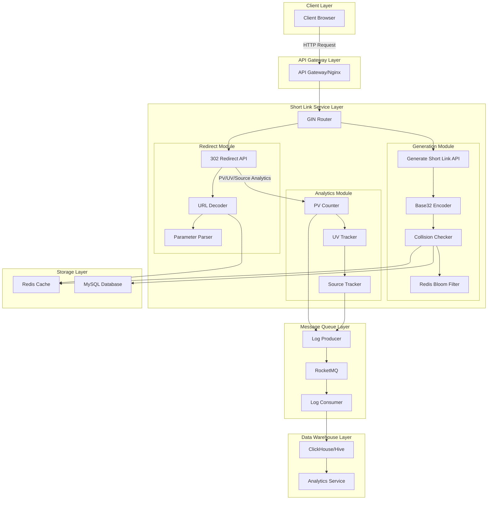
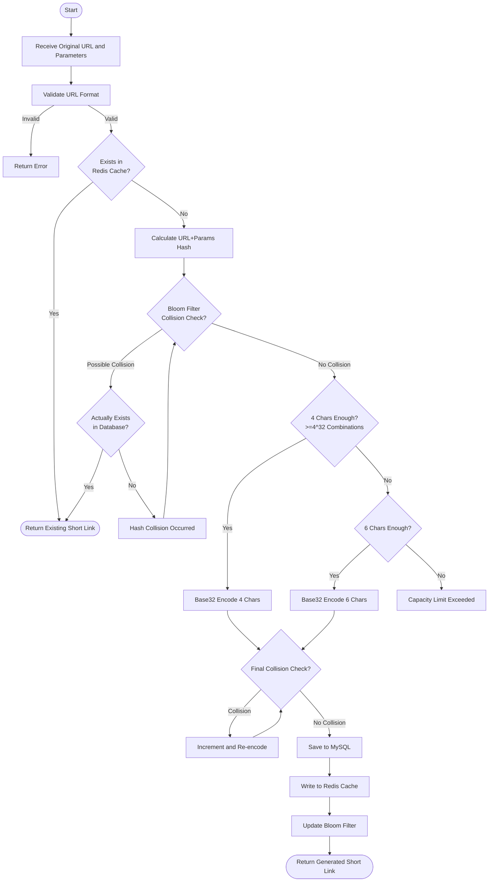
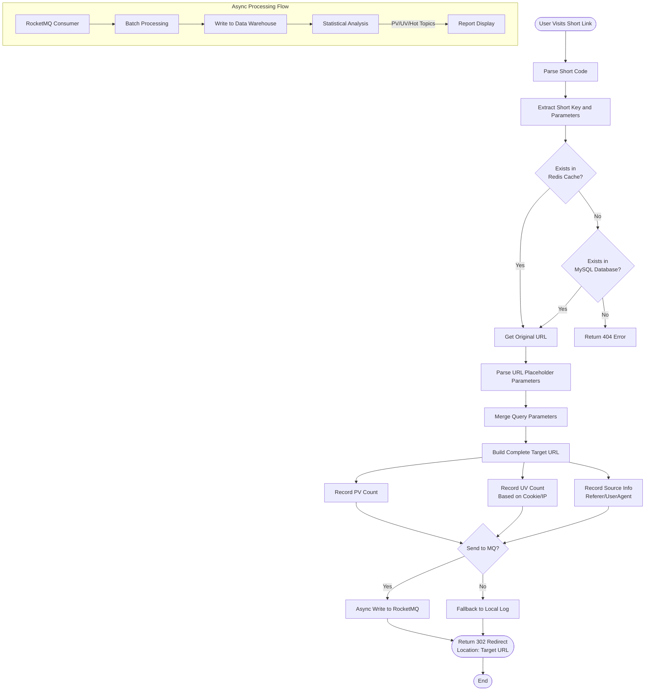

# Short Link Service Design Document

## Overview

This document describes the design of a short link service based on Go/Gin framework, providing URL shortening and redirection capabilities with parameter merging, access analytics, and traffic source analysis.

## Tech Stack

| Component | Technology |
|-----------|------------|
| Web Framework | Gin |
| Encoding Algorithm | Base32 |
| Cache | Redis |
| Bloom Filter | Redis Bloom Filter |
| Database | MySQL |
| Message Queue | RocketMQ |
| Data Warehouse | ClickHouse/Hive |

## 1. Application Architecture



## 2. Short Link Generation Algorithm



### Generation Algorithm Description

1. **Input Validation**: Validate the original URL format
2. **Cache Check**: Check if a short link for this URL already exists in Redis
3. **Hash Calculation**: Calculate hash of URL + parameters
4. **Bloom Filter Check**: Use Redis Bloom Filter for fast collision detection
5. **Database Verification**: Query database when Bloom Filter indicates possible collision
6. **Base32 Encoding**: Generate 4-6 character short link from hash value
7. **Collision Handling**: Increment hash value and re-encode when collision detected
8. **Persistence**: Save to MySQL and Redis, update Bloom Filter

## 3. Short Link Redirect Algorithm



### Redirect Algorithm Description

1. **URL Parsing**: Parse short link key and attached parameters
2. **Query Original URL**: Get from Redis first, fallback to MySQL if cache miss
3. **Parameter Processing**: Parse URL placeholders, merge query parameters
4. **Analytics Collection**: Collect PV, UV and source information
5. **Async Logging**: Send analytics data to RocketMQ
6. **302 Redirect**: Return HTTP 302 status code with Location header

## 4. Base32 Encoding

### Character Set

Base32 uses character set: `ABCDEFGHIJKLMNOPQRSTUVWXYZ234567`

### Capacity Calculation

| Short Link Length | Combinations | Description |
|-------------------|--------------|-------------|
| 4 characters | 32^4 = 1,048,576 | ~1 million, suitable for small scale |
| 5 characters | 32^5 = 33,554,432 | ~33 million, medium scale |
| 6 characters | 32^6 = 1,073,741,824 | ~1 billion, large scale |

### Encoding Strategy

- Prefer 4-character encoding
- Auto-upgrade to 5 characters when 4-character collision rate is high or capacity insufficient
- Use 6 characters in extreme cases

## 5. Project Structure

```
shortlink/
├── cmd/
│   └── server/
│       └── main.go           # Application entry point
├── internal/
│   ├── handler/
│   │   ├── generate.go       # Generate short link handler
│   │   └── redirect.go       # Redirect handler
│   ├── service/
│   │   ├── shortlink.go      # Short link service
│   │   ├── bloom.go          # Bloom Filter service
│   │   └── analytics.go      # Analytics service
│   ├── repository/
│   │   ├── redis.go          # Redis operations
│   │   └── mysql.go          # MySQL operations
│   ├── mq/
│   │   ├── producer.go       # RocketMQ producer
│   │   └── consumer.go       # RocketMQ consumer
│   ├── encoder/
│   │   └── base32.go         # Base32 encoder
│   └── model/
│       ├── shortlink.go      # Short link data model
│       └── access_log.go     # Access log model
├── pkg/
│   ├── config/
│   │   └── config.go         # Configuration management
│   └── middleware/
│       ├── logger.go         # Logging middleware
│       └── recovery.go       # Panic recovery
├── go.mod
└── go.sum
```

## 6. API Design

### 1. Generate Short Link

**Request**

```http
POST /api/v1/shortlink/generate
Content-Type: application/json

{
  "url": "https://example.com/path",
  "params": {
    "utm_source": "wechat",
    "campaign": "promo123"
  }
}
```

**Response**

```json
{
  "code": 0,
  "message": "success",
  "data": {
    "short_link": "https://s.example.com/AbCd",
    "short_code": "AbCd",
    "original_url": "https://example.com/path",
    "expire_at": "2025-12-31T23:59:59Z"
  }
}
```

### 2. Short Link Redirect

**Request**

```http
GET /AbCd?param1=value1
```

**Response**

```http
HTTP/1.1 302 Found
Location: https://example.com/path?param1=value1&utm_source=wechat&campaign=promo123
```

### 3. Analytics Query

**Request**

```http
GET /api/v1/analytics/AbCd
```

**Response**

```json
{
  "code": 0,
  "message": "success",
  "data": {
    "short_code": "AbCd",
    "pv": 10000,
    "uv": 3500,
    "top_sources": [
      {"source": "wechat", "count": 4000},
      {"source": "weibo", "count": 2500},
      {"source": "direct", "count": 3500}
    ]
  }
}
```

## 7. Data Models

### Short Links Table (short_links)

| Field | Type | Description |
|-------|------|-------------|
| id | bigint | Primary key |
| short_code | varchar(6) | Short code |
| original_url | varchar(2048) | Original URL |
| params | json | Parameter template |
| created_at | datetime | Creation time |
| expire_at | datetime | Expiration time |
| status | tinyint | Status: 1-active, 0-disabled |

### Access Logs Table (access_logs)

| Field | Type | Description |
|-------|------|-------------|
| id | bigint | Primary key |
| short_code | varchar(6) | Short code |
| client_ip | varchar(64) | Client IP |
| user_agent | varchar(512) | User-Agent |
| referer | varchar(512) | Referrer page |
| access_time | datetime | Access time |

## 8. Core Features

### 1. Collision Detection

- Use Redis Bloom Filter for fast pre-check
- Perform exact database query on Bloom Filter false positives
- Increment hash value and re-encode on collision

### 2. PV/UV Analytics

- **PV (Page View)**: Count every visit, stored in Redis Counter
- **UV (Unique Visitor)**: Deduplicated statistics based on user Cookie/IP

### 3. Traffic Source Analysis

- Parse HTTP Referer header to get traffic source
- Count visits from each source
- Identify hot promotion channels

### 4. Async Log Processing

- Access logs are first written to RocketMQ
- Consumer batch processes and writes to data warehouse
- Ensures high availability, falls back to local logging on MQ failure
