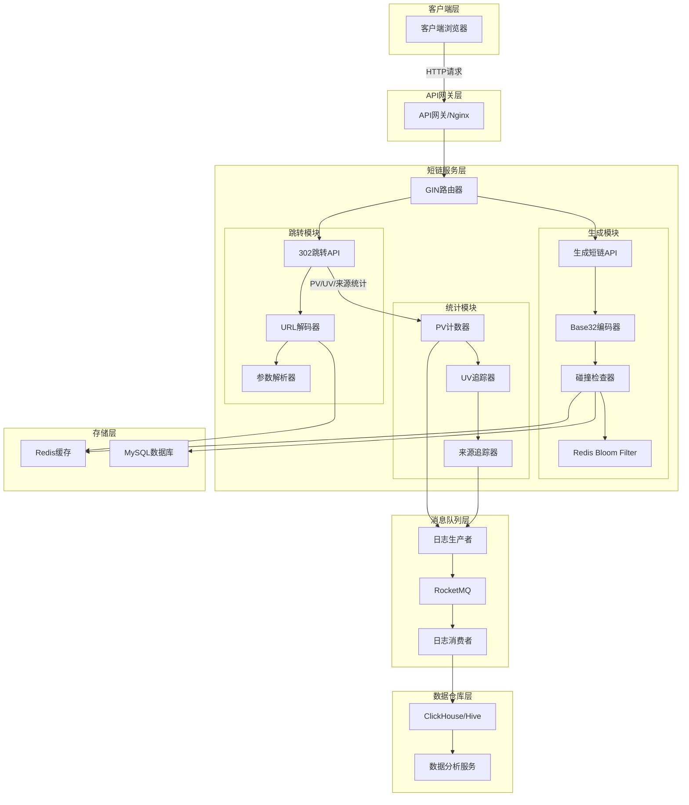
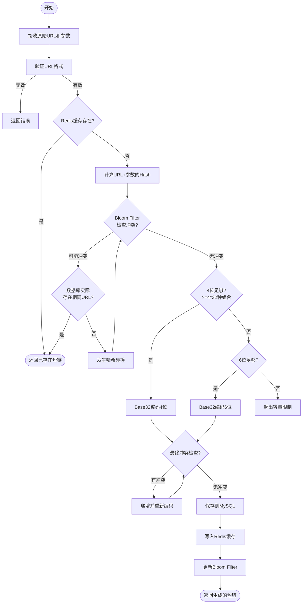
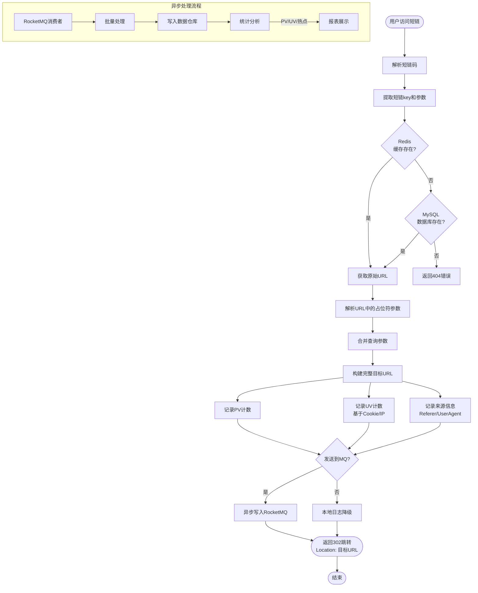

# 短链服务设计文档

## 概述

本文档描述一个基于 Go/Gin 框架的短链服务设计方案，提供 URL 短链生成与跳转功能，支持带参数跳转、访问统计和热点分析。

## 技术栈

| 组件 | 技术选型 |
|------|----------|
| Web框架 | Gin |
| 编码算法 | Base32 |
| 缓存 | Redis |
| Bloom Filter | Redis Bloom Filter |
| 数据库 | MySQL |
| 消息队列 | RocketMQ |
| 数据仓库 | ClickHouse/Hive |

## 一、应用架构图



## 二、短链生成算法流程图



### 生成算法说明

1. **输入验证**: 验证原始 URL 格式是否合法
2. **缓存检查**: 先检查 Redis 是否已存在相同 URL 的短链
3. **Hash 计算**: 对 URL + 参数进行 Hash 计算
4. **Bloom Filter 检查**: 使用 Redis Bloom Filter 快速判断是否可能存在冲突
5. **数据库验证**: Bloom Filter 存在可能冲突时，查询数据库确认
6. **Base32 编码**: 根据 Hash 值生成 4-6 位短链
7. **冲突处理**: 检测到冲突时递增 Hash 值重新编码
8. **持久化**: 保存到 MySQL 和 Redis，更新 Bloom Filter

## 三、短链跳转算法流程图



### 跳转算法说明

1. **URL 解析**: 解析短链 key 和附带参数
2. **查询原始 URL**: 优先从 Redis 获取，未命中则查询 MySQL
3. **参数处理**: 解析 URL 占位符，合并查询参数
4. **统计收集**: 收集 PV、UV 和来源信息
5. **异步日志**: 将统计数据发送到 RocketMQ
6. **302 跳转**: 返回 HTTP 302 状态码和 Location 头

## 四、Base32 编码说明

### 字符集

Base32 使用字符集: `ABCDEFGHIJKLMNOPQRSTUVWXYZ234567`

### 容量计算

| 短链长度 | 组合数量 | 说明 |
|----------|----------|------|
| 4 位 | 32^4 = 1,048,576 | 约 100 万，适合小规模使用 |
| 5 位 | 32^5 = 33,554,432 | 约 3300 万，中等规模 |
| 6 位 | 32^6 = 1,073,741,824 | 约 10 亿，大规模应用 |

### 编码策略

- 优先使用 4 位编码
- 当 4 位冲突率高或容量不足时，自动升级到 5 位
- 极端情况下使用 6 位

## 五、项目结构

```
shortlink/
├── cmd/
│   └── server/
│       └── main.go           # 服务入口
├── internal/
│   ├── handler/
│   │   ├── generate.go       # 生成短链处理器
│   │   └── redirect.go       # 跳转处理器
│   ├── service/
│   │   ├── shortlink.go      # 短链服务
│   │   ├── bloom.go          # Bloom Filter服务
│   │   └── analytics.go      # 统计服务
│   ├── repository/
│   │   ├── redis.go          # Redis操作
│   │   └── mysql.go          # MySQL操作
│   ├── mq/
│   │   ├── producer.go       # RocketMQ生产者
│   │   └── consumer.go       # RocketMQ消费者
│   ├── encoder/
│   │   └── base32.go         # Base32编码器
│   └── model/
│       ├── shortlink.go      # 短链数据模型
│       └── access_log.go     # 访问日志模型
├── pkg/
│   ├── config/
│   │   └── config.go         # 配置管理
│   └── middleware/
│       ├── logger.go         # 日志中间件
│       └── recovery.go       # 异常恢复
├── go.mod
└── go.sum
```

## 六、API 接口设计

### 1. 生成短链

**请求**

```http
POST /api/v1/shortlink/generate
Content-Type: application/json

{
  "url": "https://example.com/path",
  "params": {
    "utm_source": "wechat",
    "campaign": "promo123"
  }
}
```

**响应**

```json
{
  "code": 0,
  "message": "success",
  "data": {
    "short_link": "https://s.example.com/AbCd",
    "short_code": "AbCd",
    "original_url": "https://example.com/path",
    "expire_at": "2025-12-31T23:59:59Z"
  }
}
```

### 2. 短链跳转

**请求**

```http
GET /AbCd?param1=value1
```

**响应**

```http
HTTP/1.1 302 Found
Location: https://example.com/path?param1=value1&utm_source=wechat&campaign=promo123
```

### 3. 统计查询

**请求**

```http
GET /api/v1/analytics/AbCd
```

**响应**

```json
{
  "code": 0,
  "message": "success",
  "data": {
    "short_code": "AbCd",
    "pv": 10000,
    "uv": 3500,
    "top_sources": [
      {"source": "wechat", "count": 4000},
      {"source": "weibo", "count": 2500},
      {"source": "direct", "count": 3500}
    ]
  }
}
```

## 七、数据模型

### 短链表 (short_links)

| 字段 | 类型 | 说明 |
|------|------|------|
| id | bigint | 主键 |
| short_code | varchar(6) | 短链码 |
| original_url | varchar(2048) | 原始URL |
| params | json | 参数模板 |
| created_at | datetime | 创建时间 |
| expire_at | datetime | 过期时间 |
| status | tinyint | 状态：1-正常，0-禁用 |

### 访问日志表 (access_logs)

| 字段 | 类型 | 说明 |
|------|------|------|
| id | bigint | 主键 |
| short_code | varchar(6) | 短链码 |
| client_ip | varchar(64) | 客户端IP |
| user_agent | varchar(512) | User-Agent |
| referer | varchar(512) | 来源页面 |
| access_time | datetime | 访问时间 |

## 八、核心功能点

### 1. 碰撞检测

- 使用 Redis Bloom Filter 进行快速预检测
- Bloom Filter 误报时进行数据库精确查询
- 发生冲突时递增 Hash 值重新编码

### 2. PV/UV 统计

- **PV (Page View)**: 每次访问计数，存储在 Redis Counter
- **UV (Unique Visitor)**: 基于用户 Cookie/IP 去重统计

### 3. 热点来源分析

- 解析 HTTP Referer 头获取访问来源
- 统计各来源的访问次数
- 识别热点推广渠道

### 4. 异步日志回填

- 访问日志先写入 RocketMQ
- 消费者批量处理写入数据仓库
- 保证服务高可用，MQ 故障时降级到本地日志
